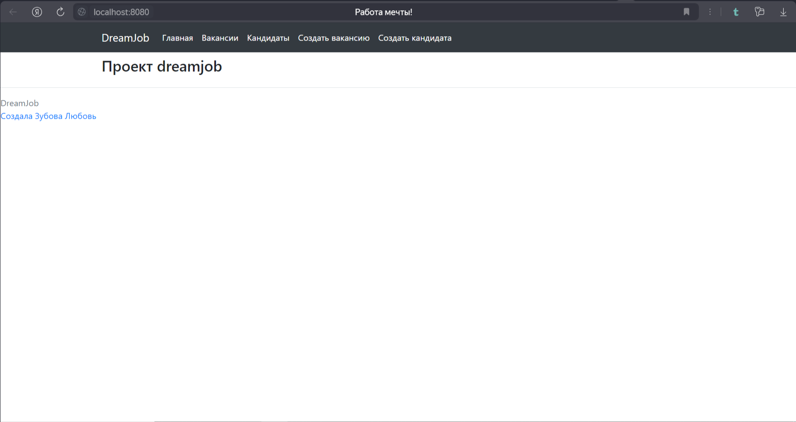
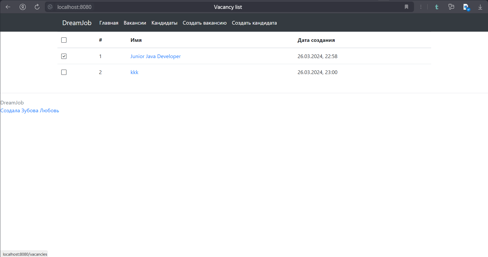
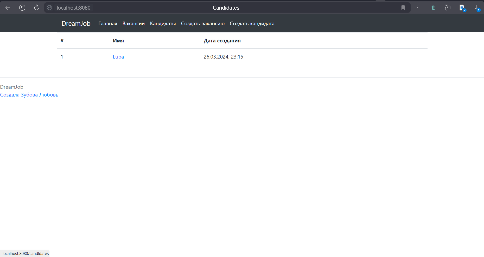
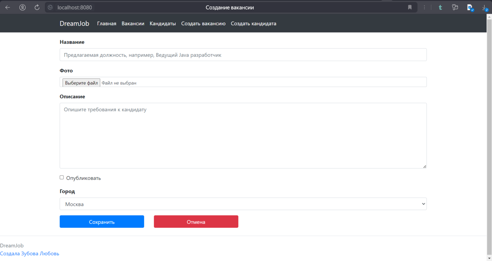
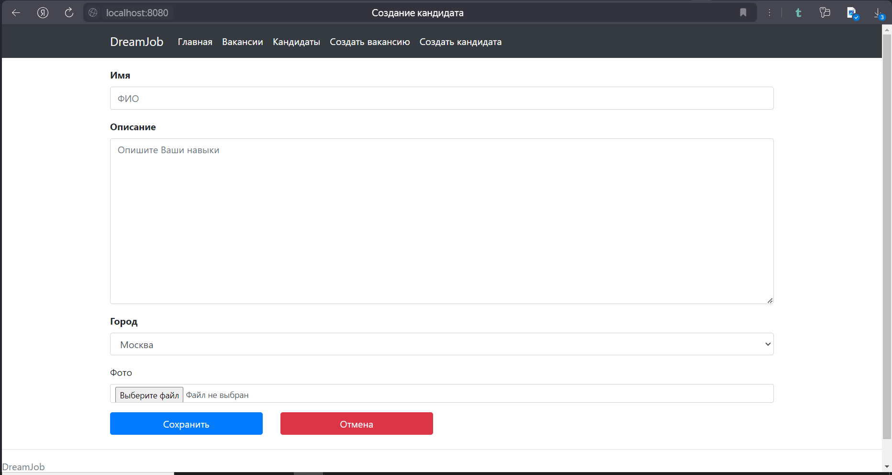

В данном репозитории представлено web-приложение "Работа мечты". В системе имеются две модели: вакансии и кандидаты.

Кадровики публикуют вакансии о работе. Кадровик может пригласить на вакансию кандидата.

Кандидаты публикуют резюме. Кандидаты могут откликнуться на вакансию.

В приложении используется Spring (в частности, Spring MVC и Spring Boot) как основной фреймворк.

Главная страница:

Страница вакансий:

Страница кандидатов:

Страница создания вакансии:

Страница создания кандидата:

