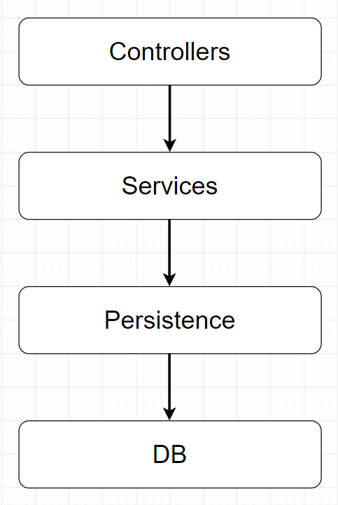

# Контрольные вопросы. Web:

## Оглавление

## Git

1. [Что такое индекс?](#1-Что-такое-индекс)
2. [Как добавить изменения в индекс?](#2-Как-добавить-изменения-в-индекс)
3. [Как сделать фиксацию изменений?](#3-Как-сделать-фиксацию-изменений)
4. [Как сделать синхронизацию изменений с удаленным репозиторием?](#4-Как-сделать-синхронизацию-изменений-с-удаленным-репозиторием)
5. [Как синхронизироваться с удаленным репозиторием?](#5-Как-синхронизироваться-с-удаленным-репозиторием)
6. [Как создать ветку?](#6-Как-создать-ветку)
7. [Как переключиться между ветками?](#7-Как-переключиться-между-ветками)
8. [Как отменить локальные изменения?](#8-Как-отменить-локальные-изменения)
9. [Расскажи о команде git reset?](#9-Расскажи-о-команде-git-reset)
10. [Расскажите о команде git stash](#10-Расскажите-о-команде-git-stash)
11. [Расскажите о команде git cherry-pick](#11-Расскажите-о-команде-git-cherry-pick)
12. [Расскажите о команде git rerere. Расскажите, как разрешаются конфликты.](#12-Расскажите-о-команде-git-rerere-Расскажите-как-разрешаются-конфликты)

## Http протокол

1. [Расскажите, чем отличается UDP от TCP/IP.](#1-Расскажите-чем-отличается-UDP-от-TCP/IP)
2. [Расскажите о методах HTTP протокола. Подробно рассказать отличие в заголовке и теле запросов: GET, POST, PUT, DELETE.](#2-Расскажите-о-методах-HTTP-протокола-Подробно-рассказать-отличие-в-заголовке-и-теле-запросов-GET-POST-PUT-DELETE)
3. [Расскажите о статусах HTTP протокола.](#3-Расскажите-о-статусах-HTTP-протокола)
4. [Расскажите о mime-type HTTP протокола.](#4-Расскажите-о-mime-type-HTTP-протокола)

## Веб-контейнер

1. [Что такое сервлет?](#1-Что-такое-сервлет)
2. [Какова структура веб-проекта?](#2-Какова-структура-веб-проекта)
3. [Что такое контейнер сервлетов?](#3-Что-такое-контейнер-сервлетов)
4. [Каковы задачи, функциональность контейнера сервлетов?](#4-Каковы-задачи-функциональность-контейнера-сервлетов)
5. [Что вы знаете о сервлет фильтрах?](#5-Что-вы-знаете-о-сервлет-фильтрах)
6. [Зачем нужны слушатели в сервлетах?](#6-Зачем-нужны-слушатели-в-сервлетах)
7. [Когда вы будете использовать фильтры, а когда слушатели?](#7-Когда-вы-будете-использовать-фильтры-а-когда-слушатели)
8. [Как обработать исключения, выброшенные другим сервлетом в приложении?](#8-Как-обработать-исключения-выброшенные-другим-сервлетом-в-приложении)
9. [Что такое дескриптор развертывания?](#9-Что-такое-дескриптор-развертывания)
10. [Как реализовать запуск сервлета с запуском приложения?](#10-Как-реализовать-запуск-сервлета-с-запуском-приложения)
11. [Что представляет собой объект ServletConfig?](#11-Что-представляет-собой-объект-ServletConfig)
12. [Что представляет собой объект ServletContext?](#12-Что-представляет-собой-объект-ServletContext)
13. [В чем отличия ServletContext и ServletConfig?](#13-В-чем-отличия-ServletContext-и-ServletConfig)
14. [Что такое Request Dispatcher?](#14-Что-такое-Request-Dispatcher)

## Thymeleaf

1. [Расскажите о назначении Thymeleaf?](#1-Расскажите-о-назначении-Thymeleaf)
2. [Расскажите про тег th:text.](#2-Расскажите-про-тег-th:text)
3. [Расскажите про тег th:if.](#3-Расскажите-про-тег-th:if)
4. [Расскажите про тег th:href.](#4-Расскажите-про-тег-th:ref)
5. [Расскажите про тег th:each.](#5-Расскажите-про-тег-th:each)
6. [Расскажите про тег th:object.](#6-Расскажите-про-тег-th:object)
7. [Расскажите про тег th:action.](#7-Расскажите-про-тег-th:action)

## Spring boot

1. [Опишите из каких компонентов состоит Spring boot?](#1-Опишите-из-каких-компонентов-состоит-Spring-boot)
2. [Что такое контроллер и как он связан с DispatcherServlet.](#2-Что-такое-контроллер-и-как-он-связан-с-DispatcherServlet)
3. [Что такое стереотипные аннотации? Какие они бывают?](#3-Что-такое-стереотипные-аннотации-Какие-они-бывают)
4. [Что такое DI? Как он реализован в Spring?](#4-Что-такое-DI-Как-он-реализован-в-Spring?)
5. [Опишите аннотации @ModelAttribute, @PathVariable, @RequestParam](#5-Опишите-аннотации-ModelAttribute-PathVariable-RequestParam)
6. [Опишите аннотации @GetMapping, @PostMapping.](#6-Опишите-аннотации-GetMapping-PostMapping)

## Многопоточность

1. [Объясните, где в веб приложении появляется многопоточность?](#1-Объясните-где-в-веб-приложении-появляется-многопоточность)
2. [Как избежать проблем в многопоточности?](#2-Как-избежать-проблем-в-многопоточности)
3. [Как можно создать блокировку (deadlock) в сервлете?](#3-Как-можно-создать-блокировку-deadlock-в-сервлете)
4. [Как решать проблемы многопоточности на уровне базы данных?](#4-Как-решать-проблемы-многопоточности-на-уровне-базы-данных)

## Архитектура:

1. [Объясните слоеную архитектуру.](#1-Объясните-слоеную-архитектуру)
2. [Объясните шаблон MVC на примере Servlet.](#2-Объясните-шаблон-MVC-на-примере-Servlet)
3. [Объясните шаблон MVC на примере Spring boot.](#3-Объясните-шаблон-MVC-на-примере-Spring-boot)

## База данных

1. [Зачем нужен пул соединений?](#1-Зачем-нужен-пул-соединений)

## Безопасность

1. [Что такое HttpSession?](#1-Что-такое-HttpSession)
2. [Что такое авторизация?](#2-Что-такое-авторизация)
3. [Что такое аутентификация?](#3-Что-такое-аутентификация)
4. [Что такое cookie?](#4-Что-такое-cookie)

## Git

### 1 Что такое индекс?

Индекс в Git — это специальная промежуточная область, в которой хранятся изменения файлов на пути от рабочей директории
до репозитория. При выполнении коммита в него попадают только те изменения, которые были добавлены в индекс.

[К оглавлению Git &#8593;](#Git)

### 2 Как добавить изменения в индекс?

`git add .`  - добавляет абсолютно все изменения рабочей директории в индекс

[К оглавлению Git &#8593;](#Git)

### 3 Как сделать фиксацию изменений?

git commit -m "text"

[К оглавлению Git &#8593;](#Git)

### 4 Как сделать синхронизацию изменений с удаленным репозиторием?

git push origin master

[К оглавлению Git &#8593;](#Git)

### 5 Как синхронизироваться с удаленным репозиторием?

git pull origin master

[К оглавлению Git &#8593;](#Git)

### 6 Как создать ветку?

git branch _названиеВетки_

git branch --> посмотреть имеющиеся ветки

[К оглавлению Git &#8593;](#Git)

### 7 Как переключиться между ветками?

git checkout _названиеВетки_

[К оглавлению Git &#8593;](#Git)

### 8 Как отменить локальные изменения?

git reset --soft rev

[К оглавлению Git &#8593;](#Git)

### 9 Расскажи о команде git reset?

Команда откатит состояние к коммиту и загрузит измененные файлы. Измененные файлы будут в режиме редактирования.

[К оглавлению Git &#8593;](#Git)

### 10 Расскажите о команде git stash

Команда git stash позволяет сохранить изменения, если срочно нужно переключиться на другую задачу.

Git > Uncommitted Changes > Stash changes ... -> репозиторий переходит в последнее зафиксированное состояние.

Git - Unstash -> Вернём изменения

[К оглавлению Git &#8593;](#Git)

### 11 Расскажите о команде git cherry-pick

git cherry-pick - команда, с помощью которой можно выборочно применить коммиты Git к текущей рабочей ветке HEAD. С ее
помощью можно выбрать коммит из одной ветки и применить его к другой.

[К оглавлению Git &#8593;](#Git)

### 12 Расскажите о команде git rerere. Расскажите, как разрешаются конфликты.

git rerere - её имя является сокращением для «reuse recorded resolution» («повторно использовать сохранённое решение»).
Как следует из названия, эта функциональность позволяет попросить Git запомнить то, как вы разрешили некоторую часть
конфликта, так что в случае возникновения такого же конфликта, Git сможет его разрешить автоматически.

[К оглавлению Git &#8593;](#Git)

[К общему оглавлению &#8593;](#Оглавление)

## Http протокол

### 1 Расскажите, чем отличается UDP от TCP/IP.

UDP - протокол без соединения, без требований к открытию, поддержанию или прерыванию соединения, TCP - требуется
установленное соединение для передачи данных

UDP не гарантирует доставку данных получателю, TCP гарантирует доставку данных получателю

UDP - отсутствие повторной передачи потерянных пакетов, TCP - повторная передача нескольких кадров в случае потери
одного из них

протокол UDP - имеет базовый механизм проверки ошибок, использует вышестоящие протоколы для проверки целостности, TCP -
полная проверка ошибок

UDP - неупорядоченная доставка данных, TCP - упорядоченная доставка данных

UDP - более быстрый, TCP - медленный

UDP - UDP-пакеты с определенными границами; отправляются по отдельности и проверяются на целостность по прибытии, TCP -
данные считываются как поток байтов; сообщения передаются по границам сегментов

[К оглавлению - Http протокол &#8593;](#Http-протокол)

### 2 Расскажите о методах HTTP протокола. Подробно рассказать отличие в заголовке и теле запросов: GET, POST, PUT, DELETE.

HTTP — основной интернет-протокол современного веба. В основе его работы лежат запросы и их методы, определяющие, что
именно будет происходить с данными на серверах. Ключевые из них — GET и POST.

GET — запрашивает контент из сервера. Поэтому у запросов с методом GET нет тела сообщения.

POST — публикует информацию на сервере. POST-запрос может передавать разную информацию: параметры в формате
ключ=значение, JSON, HTML-код или даже файлы. Вся информация передается в теле сообщения.

[К оглавлению - Http протокол &#8593;](#Http-протокол)

### 3 Расскажите о статусах HTTP протокола.

Response Status Codes всегда трехзначные, и первая цифра кода указывает категорию ответа:

- 1xx — информационный ответ. Запрос получен, сервер готов к продолжению;
- 2xx — успешный ответ. Запрос получен, понятен и обработан;
- 3xx — перенаправление. Следующие действия нужно выполнить для обработки запроса;
- 4xx — ошибка клиента. Запрос содержит ошибки или не отвечает протоколу;
- 5xx — ошибка сервера. Сервер не смог обработать запрос, хотя был составлен верно;

Вторая и третья цифры в коде детализируют ответ.

Рассмотрим основные коды, которые чаще всего встречаются в реальных задачах:

+ 100 Continue — промежуточный ответ. Он указывает, что запрос успешно принят. Клиент может продолжать присылать запросы
  или проигнорировать этот ответ, если запрос был завершён.

+ 101 Switching Protocol присылается в ответ на запрос, в котором есть заголовок Upgrade. Это означает, что сервер
  переключился на протокол, который был указан в заголовке. Такая методика используется, например, для переключения на
  протокол Websocket.

+ 102 Processing — запрос получен сервером, но его обработка ещё не завершена.

+ 200 OK — запрос принят и корректно обработан веб-сервером.

+ 201 Created — запрос корректно обработан и в результате был создан новый ресурс. Обычно он присылается в ответ на POST
  запрос.

+ 301 Moved Permanently — запрашиваемый ресурс на постоянной основе переехал на новый адрес. Тогда новый путь к ресурсу
  указывается сервером в заголовке Location ответа.

+ Примечание 302 Found — указывает, что целевой ресурс временно доступен по другому URl. Адрес перенаправления может
  быть изменен в любое время, а клиент должен продолжать использовать действующий URI для будущих запросов. Тогда
  временный путь к ресурсу указывается сервером в заголовке Location ответа.

+ Примечание 307 Temporary Redirect — имеет то же значение, что и код 302, за исключением того, что клиент не может
  менять метод последующего запроса.

+ 308 Permanent Redirect — имеет то же значение, что и код 301, за исключением того, что клиент не может менять метод
  последующего запроса.

+ 400 Bad Request — запрос от клиента к веб-серверу составлен некорректно. Обычно это происходит, если клиент не
  передаёт необходимые заголовки или параметры.

+ 401 Unauthorized — получение запрашиваемого ресурса доступно только аутентифицированным пользователям.

+ 403 Forbidden — у клиента не хватает прав для получения запрашиваемого ресурса. Например, когда обычный пользователь
  сайта пытается получить доступ к панели администратора.

+ 404 Not Found — сервер не смог найти запрашиваемый ресурс.

+ 405 Method Not Allowed — сервер знает о существовании HTTP-метода, который был указан в запросе, но не поддерживает
  его. В таком случае сервер должен вернуть список поддерживаемых методов в заголовке Allow ответа.

+ 500 Internal Server Error — на сервере произошла непредвиденная ошибка.

+ 501 Not Implemented — метод запроса не поддерживается сервером и не может быть обработан.

+ 502 Bad Gateway — сервер, действуя как шлюз или прокси, получил недопустимый ответ от входящего сервера, к которому он
  обращался при попытке выполнить запрос.

+ 503 Service Unavailable — сервер не готов обработать запрос (например, из-за технического обслуживания или перегрузки)
  . Обратите внимание, что вместе с этим ответом должна быть отправлена ​​удобная страница с объяснением проблемы. Этот
  ответ следует использовать для временных условий, а HTTP-заголовок Retry-After по возможности должен содержать
  расчётное время до восстановления службы.

+ 504 Gateway Timeout — этот ответ об ошибке выдается, когда сервер действует как шлюз и не может получить ответ за
  отведенное время.

+ 505 HTTP Version Not Supported — версия HTTP, используемая в запросе, не поддерживается сервером.

[К оглавлению - Http протокол &#8593;](#Http-протокол)

### 4 Расскажите о mime-type HTTP протокола.

MIME типы позволяют указывать тип получаемого файла, чтобы браузер мог правильно его обработать.

Например, браузер должен понимать, что в полученном файле лежит CSS, либо картинка и интерпретировать их соответствующим
образом.

Указание MIME типа в протоколе HTTP осуществляется в заголовке Content-Type. Рассмотрим самые популярные варианты:

+ Содержимое - HTML код:
  `Content-Type: text/html`

+ Содержимое - CSS код:
  `Content-Type: text/css`

+ Содержимое - JavaScript код:
  `Content-Type: text/javascript`

+ Содержимое - простой текст:
  `Content-Type: text/plain`

+ Содержимое - PNG изображение:
  `Content-Type: image/png`

+ Содержимое - JPG изображение:
  `Content-Type: image/jpeg`

+ Содержимое - текст в формате JSON:
  `Content-Type: application/json`

+ Содержимое - текст в формате XML:
  `Content-Type: text/xml`

[К оглавлению - Http протокол &#8593;](#Http-протокол)

[К общему оглавлению &#8593;](#Оглавление)

## Веб-контейнер

### 1 Что такое сервлет?

Сервлет - это интерфейс Java, реализация которого расширяет функциональные возможности сервера. Сервлет взаимодействует
с клиентами посредством принципа запрос-ответ. Хотя сервлеты могут обслуживать любые запросы, они обычно используются
для расширения веб-серверов. Для таких приложений технология Java Servlet определяет HTTP-специфичные сервлет классы.
Пакеты javax.servlet и javax.servlet.http обеспечивают интерфейсы и классы для создания сервлетов.

[К оглавлению Веб-контейнер &#8593;](#Веб-контейнер)

### 2 Какова структура веб-проекта?

src/main/java - Application/Library sources  
src/main/resources - Application/Library resources  
src/main/filters - Resource filter files  
src/main/webapp - Web application sources  
src/test/java - Test sources  
src/test/resources - Test resources  
src/test/filters - Test resource filter files  
src/it - Integration Tests (primarily for plugins)  
src/assembly - Assembly descriptors  
src/site - Site  
LICENSE.txt - Project’s license  
NOTICE.txt - Notices and attributions required by libraries that the project depends on  
README.txt - Project’s readme

[К оглавлению Веб-контейнер &#8593;](#Веб-контейнер)

### 3 Что такое контейнер сервлетов?

Контейнер сервлетов — программа, представляющая собой сервер, который занимается системной поддержкой сервлетов и
обеспечивает их жизненный цикл в соответствии с правилами, определёнными в спецификациях.

Известные реализации: Apache Tomcat, Jetty, JBoss, GlassFish, IBM WebSphere, Oracle Weblogic.

[К оглавлению Веб-контейнер &#8593;](#Веб-контейнер)

### 4 Каковы задачи, функциональность контейнера сервлетов?

Контейнер сервлетов может работать как полноценный самостоятельный веб-сервер, быть поставщиком страниц для другого
веб-сервера, например Apache, или интегрироваться в Java EE сервер приложений. Обеспечивает обмен данными между
сервлетом и клиентами, берёт на себя выполнение таких функций, как создание программной среды для функционирующего
сервлета, идентификацию и авторизацию клиентов, организацию сессии для каждого из них.

[К оглавлению Веб-контейнер &#8593;](#Веб-контейнер)

### 5 Что вы знаете о сервлет фильтрах?

Сервлетный фильтр - это Java-код, пригодный для повторного использования и позволяющий преобразовать содержание
HTTP-запросов, HTTP-ответов и информацию, содержащуюся в заголовках HTTP. Сервлетный фильтр занимается предварительной
обработкой запроса, прежде чем тот попадает в сервлет, и/или последующей обработкой ответа, исходящего из сервлета.

Сервлетные фильтры могут:

- перехватывать инициализацию сервлета прежде, чем сервлет будет инициирован;
- определить содержание запроса прежде, чем сервлет будет инициирован;
- модифицировать заголовки и данные запроса, в которые упаковывается поступающий запрос;
- модифицировать заголовки и данные ответа, в которые упаковывается получаемый ответ;
- перехватывать инициализацию сервлета после обращения к сервлету.

Сервлетный фильтр может быть сконфигурирован так, что он будет работать с одним сервлетом или группой сервлетов. Основой
для формирования фильтров служит интерфейс javax.servlet.Filter, который реализует три метода:

- void init (FilterConfig config) throws ServletException;
- void doFilter (ServletRequest request, ServletResponse response, FilterChain chain) throws IOException,
  ServletException;
- void destroy();

Метод _init_ вызывается прежде, чем фильтр начинает работать, и настраивает конфигурационный объект фильтра.  
Метод _doFilter_ выполняет непосредственно работу фильтра.  
Таким образом, сервер вызывает init() один раз, чтобы запустить фильтр в работу, а затем вызывает doFilter() столько
раз, сколько запросов будет сделано непосредственно к данному фильтру. После того как фильтр заканчивает свою работу,
вызывается метод destroy().

[К оглавлению Веб-контейнер &#8593;](#Веб-контейнер)

### 6 Зачем нужны слушатели в сервлетах?

Слушатели контекста и сессий — это классы, которые могут

1. следить за тем, когда контекст или сессия были инициализированы,
2. отслеживать время, когда контекст или сессия должны быть уничтожены,
3. отслеживать время, когда атрибуты были добавлены или удалены из контекста или сессии.

Servlet 2.4 расширяет модель слушателей запроса, позволяя отслеживать, как запрос создается и уничтожается и как
атрибуты добавляются и удаляются из сервлета.

В Servlet 2.4 добавлены следующие классы:

- ServletRequestListener
- ServletRequestEvent
- ServletRequestAttributeListener
- ServletRequestAttributeEvent

[К оглавлению Веб-контейнер &#8593;](#Веб-контейнер)

### 7 Когда вы будете использовать фильтры, а когда слушатели?

Следует использовать фильтры, если необходимо обрабатывать входящие или исходящие данные (например: для аутентификации,
преобразования формата, компрессии, шифрования и т.д.).

В случае, когда необходимо реагировать на события, лучше применять слушателей.

[К оглавлению Веб-контейнер &#8593;](#Веб-контейнер)

### 8 Как обработать исключения, выброшенные другим сервлетом в приложении?

Т.к. браузер понимает только HTTP, то когда приложение выбросит исключение, контейнер сервлетов обработает исключение и
создаст HTTP response. Это аналогично тому, что происходит при кодах ошибок вроде 404, 403 и т.д. Servlet API
предоставляет поддержку собственных сервлетов для обработки исключений и ошибок, которые мы можем задать в дескрипторе
развертывания. Главная задача таких сервлетов — обработать ошибку или исключение и отправить понятный HTTP ответ
пользователю. Например, можно предоставить ссылку на главную страницу, а также описание некоторых деталей об ошибке.

[К оглавлению Веб-контейнер &#8593;](#Веб-контейнер)

### 9 Что такое дескриптор развертывания?

Дескриптор развертывания — это конфигурационный файл артефакта, который будет развернут в контейнере сервлетов. В
спецификации Java Platform, Enterprise Edition дескриптор развертывания описывает то, как компонент, модуль или
приложение (такое, как веб-приложение или приложение предприятия) должно быть развернуто.

Дескриптор развертывания указывает параметры развертывания для модуля или приложения с определенными настройками,
параметрами безопасности и описывает конкретные требования к конфигурации. Для синтаксиса файлов дескриптора
развертывания используется язык XML.

[К оглавлению Веб-контейнер &#8593;](#Веб-контейнер)

### 10 Как реализовать запуск сервлета с запуском приложения?

Контейнер сервлетов обычно загружает сервлет при первом запросе клиента, но иногда необходимо загрузить сервлет прямо на
старте приложения (например, если сервлет объемный и будет долго грузиться). Для этого необходимо использовать элемент
load-on-startup в дескрипторе (или аннотацию loadOnStartup), который укажет необходимость загрузки сервлета при запуске.

```
<servlet>
    <servlet-name>foo</servlet-name>
    <servlet-class>com.foo.servlets.Foo</servlet-class>
    <load-on-startup>5</load-on-startup>
</servlet>
```

Значение должно быть int. Если значение отрицательное, то сервлет будет загружен при запросе клиента, а если 0 и далее,
то загрузится на старте приложения. Чем меньше число, тем раньше в очереди на загрузку будет сервлет.

[К оглавлению Веб-контейнер &#8593;](#Веб-контейнер)

### 11 Что представляет собой объект ServletConfig?

Интерфейс javax.servlet.ServletConfig используется для передачи конфигурационной информации сервлету. Каждый сервлет
имеет свой собственный объект ServletConfig, за создание экземпляра которого ответственен контейнер сервлетов. Для
установки параметров конфигурации используются init параметры в web.xml (или аннотации WebInitParam). Для получения
объекта ServletConfig данного сервлета используется метод getServletConfig().

[К оглавлению Веб-контейнер &#8593;](#Веб-контейнер)

### 12 Что представляет собой объект ServletContext?

Интерфейс javax.servlet.ServletContext предоставляет доступ к параметрам веб приложения сервлету. Объект ServletContext
является уникальным и доступен всем сервлетам веб приложения.

Объект ServletContext можно использовать, когда необходимо предоставить доступ одному или нескольким сервлетам к
инициализированным параметрам веб приложения. Для этого используется элемент <context-param> в web.xml. Объект
ServletContext можно получить с помощью метода getServletContext() у интерфейса ServletConfig. Контейнеры сервлетов
также могут предоставлять context объекты, уникальные для группы сервлетов. Каждая из групп будет связана со своим
набором URL путей хоста.

ServletContext был расширен в спецификации Servlet 3: он предоставляет программное добавление слушателей и фильтров в
приложение. Также у этого интерфейса имеются множество полезных методов вроде getMimeType(), getResourceAsStream() и
т.д.

[К оглавлению Веб-контейнер &#8593;](#Веб-контейнер)

### 13 В чем отличия ServletContext и ServletConfig?

ServletConfig является уникальным объектом для каждого сервлета, ServletContext уникальный для всего приложения.  
ServletConfig используется для предоставления параметров инициализации сервлету, ServletContext для предоставления
параметров инициализации приложения для всех сервлетов.  
Нет возможности устанавливать атрибуты в объекте ServletConfig, в объекте ServletContext можно установить атрибуты,
которые будут доступны другим сервлетам.

[К оглавлению Веб-контейнер &#8593;](#Веб-контейнер)

### 14 Что такое Request Dispatcher?

Интерфейс RequestDispatcher используется для передачи запроса другому ресурсу (это может быть HTML, JSP или другой
сервлет в том же приложении). Мы можем использовать это для добавления контента другого ресурса к ответу. Этот интерфейс
используется для внутренней коммуникации между сервлетами в одном контексте. В интерфейсе реализовано два метода:

- void forward(ServletRequest var1, ServletResponse var2) — передает запрос из сервлета к другому ресурсу (сервлету, JSP
  или HTML файлу) на сервере.
- void include(ServletRequest var1, ServletResponse var2) — включает контент ресурса (сервлет, JSP или HTML страница) в
  ответ.

Доступ к интерфейсу можно получить с помощью метода ServletContext getRequestDispatcher(String s). Путь должен
начинаться с / , который будет интерпретироваться относительным текущего корневого пути контекста.

[К оглавлению Веб-контейнер &#8593;](#Веб-контейнер)

[К общему оглавлению &#8593;](#Оглавление)

## Thymeleaf

### 1 Расскажите о назначении Thymeleaf?

Thymeleaf - это движок шаблонов (Template engine), который создаёт из них динамические таблицы с помощью специальных
атрибутов. Он позволяет удобно контролировать процесс передачи данных из БД на вид (View), а также выбирать способ
обработки этих данных.

Основная цель Thymeleaf - обработка HTML, XML, JavaScript, CSS и обычного текста для создания с их помощью
пользовательского интерфейса, то есть это простой и удобный способ шаблонизации. На основе выражений в файле он
генерирует статическое содержимое. Thymeleaf основывается на концепции natural templates - логика Thymeleaf внедряется в
шаблоны способом, не нарушающим структуру файла.

[К оглавлению - Thymeleaf &#8593;](#Thymeleaf)

### 2 Расскажите про тег th:text.

тег th:text - отображает текст внутри тега

[К оглавлению - Thymeleaf &#8593;](#Thymeleaf)

### 3 Расскажите про тег th:if.

тег th:if - оценивает условия в атрибуте и либо выводит элемент, либо нет

[К оглавлению - Thymeleaf &#8593;](#Thymeleaf)

### 4 Расскажите про тег th:href.

th:href - адрес ссылки

[К оглавлению - Thymeleaf &#8593;](#Thymeleaf)

### 5 Расскажите про тег th:each.

th:each - отображает коллекцию (аналог цикла for-each)

[К оглавлению - Thymeleaf &#8593;](#Thymeleaf)

### 6 Расскажите про тег th:object.

th:object - указать объект

[К оглавлению - Thymeleaf &#8593;](#Thymeleaf)

### 7 Расскажите про тег th:action.

th:action - адрес для отправки формы

[К оглавлению - Thymeleaf &#8593;](#Thymeleaf)

[К общему оглавлению &#8593;](#Оглавление)

## Spring boot

### 1 Опишите из каких компонентов состоит Spring boot?

**1.1 Уровень интеграции компонентов**

+ Spring Boot
+ Spring Framework – Core

**1.2 Уровень бизнес-логики**

+ Spring Framework – Testing
+ Spring Framework – Languages
+ Spring Shell
+ Spring Statemachine
+ Spring Batch
+ Spring Security
+ Spring Security
+ Spring Security Kerberos
+ Spring Authorization Server

**2 Уровень обмена данными с хранилищами**

+ Spring Framework – Data Access
+ Spring LDAP
+ Spring Data
+ Spring Data Commons
+ Поддержка SQL БД
+ Spring Data JPA
+ Spring Data Envers
+ Spring Data REST
+ Spring Data JDBC
+ Spring Data R2DBC
+ Spring Data for Apache Solr (устарел)
+ Spring Data JDBC Extensions (устарел)

**3 Уровень сетевого обмена данными**

+ Spring Framework – Web MVC (Web Servlet)
+ Spring Framework – WebFlux (Web Reactive)
+ Spring Framework – Integration
+ Spring Web Flow
+ Spring HATEOAS
+ Spring for GraphQL
+ Spring Web Services
+ Spring REST Docs
+ MQ (Message Queue)
+ Spring AMQP
+ Spring for Apache Kafka

**4. Фреймворк корпоративной интеграции**

+ Spring Integration

[К оглавлению - Spring boot &#8593;](#Spring-boot)

### 2 Что такое контроллер и как он связан с DispatcherServlet.

Контроллер обрабатывает запрос пользователя и возвращает ответ.

DispatcherServlet принимает и обрабатывает все HTTP-запросы и ответы на них.

После получения HTTP-запроса DispatcherServlet обращается к интерфейсу _HandlerMapping_, который определяет, какой
Контроллер должен быть вызван, после чего, отправляет запрос в нужный _Контроллер_.

[К оглавлению - Spring boot &#8593;](#Spring-boot)

### 3 Что такое стереотипные аннотации? Какие они бывают?

Стереотипные аннотации - это аннотации, обозначающие специальную функциональность. Все стереотипы включают в себя
аннотацию @Component.

- @Component - корневая аннотация, которая помечает класс как кандидат для автовнедрения
- @Controller указывает, что класс является контроллером для отправления данных на фронт.
- @RestController указывает, что класс является контроллером для REST. Содержит аннотации @Controller и @ResponseBody
- @Service указывает, что класс является сервисом для выполнения бизнес-логики
- @Repository указывает, что класс является репозиторием для работы с бд
- @Configuration указывает, что класс содержит Java-конфигурацию(@Bean-методы)

[К оглавлению - Spring boot &#8593;](#Spring-boot)

### 4 Что такое DI? Как он реализован в Spring?

DI - Dependency Injection - внедрение зависимостей - принцип заключается в том, что зависимости класса не создаются или
ищутся в самом классе, а внедряются (inject) извне некоторым другим внешним источником (например, Spring).

Как правило, внедрение зависимости осуществляется через:

+ конструктор класса (constructor injection);
+ поле класса (field injection);
+ входной аргумент метода (method injection), то есть через сеттер.

[К оглавлению - Spring boot &#8593;](#Spring-boot)

### 5 Опишите аннотации @ModelAttribute, @PathVariable, @RequestParam

+ С помощью аннотации **@ModelAttribute** мы можем получить доступ к элементам, которые уже находятся в модели MVC
  @Controller, Например:

```java
@PostMapping("/pets/{petId}/edit")
public String processSubmit(@ModelAttribute Pet pet){
        // some logic
        } 
```

+ **@PathVariable** - позволяет получить доступ к захваченным URI-переменным. Например:

```java
@GetMapping("/persons/{personId}/pets/{petId}")
public Pet findPet(@PathVariable Long personId,@PathVariable Long petId){
        // logic
        }
  ```

+ **@RequestParam** обеспечивает доступ к параметрам запроса. Значения параметров преобразуются в объявленный тип
  аргументов метода.

```java
@RequestMapping("/findPet")
public Pet getPetById(@RequestParam("id") long id){
        // some logic
        }
```

Также с помощью @RequestParam можно указать значение по умолчанию, когда Spring не находит значение в запросе. Для этого
нужно установить аргумент defaultValue.

``` java
@RequestMapping("/buy")
public Car buyCar(@RequestParam(defaultValue = "5") int seatCount) {
// some logic
}
```

[К оглавлению - Spring boot &#8593;](#Spring-boot)

### 6 Опишите аннотации @GetMapping, @PostMapping.

+ @GetMapping - сокращение @RequestMapping(method = RequestMethod.GET) - для обработки GET метода входящего HTTP-запроса
+ @PostMapping - сокращение @RequestMapping(method = RequestMethod.POST) - для обработки POST метода входящего
  HTTP-запроса

[К оглавлению - Spring boot &#8593;](#Spring-boot)

[К общему оглавлению &#8593;](#Оглавление)

## Многопоточность

### 1 Объясните, где в веб приложении появляется многопоточность?

[К оглавлению - Многопоточность &#8593;](#Многопоточность)

### 2 Как избежать проблем в многопоточности?

[К оглавлению - Многопоточность &#8593;](#Многопоточность)

### 3 Как можно создать блокировку (deadlock) в сервлете?

[К оглавлению - Многопоточность &#8593;](#Многопоточность)

### 4 Как решать проблемы многопоточности на уровне базы данных?

[К оглавлению - Многопоточность &#8593;](#Многопоточность)

[К общему оглавлению &#8593;](#Оглавление)

## Архитектура

### 1 Объясните слоеную архитектуру.

Слой - это классы, имеющую одну функциональную принадлежность.

Слоеную архитектуру можно представить схематически:


Стрелки идут _только_ вниз. То есть верхний слой знает, кто идет за ним. В свою очередь, нижний слой не знает, кто его
использует. Например, слой контроллеров может использовать слой сервисов. Слой сервисов не может использовать слой
контроллеров. Слой не может перепрыгнуть через слой, то есть контроллер не может напрямую вызвать слой персистенции.

Такая схема позволяет удобно расширять приложение.

Подробнее о каждом слое:

- Слой контроллеры - это классы для работы с клиентом. Эти классы принимают запросы от клиента и отдают ответы. Клиентом
  может быть: браузер, мобильное приложение или другое приложение на Java. Все они будут работать через контроллеры.

- Слой сервисы - это классы, выполняющие бизнес логику приложения. В слое сервисов используется только бизнес логика.
  Здесь не должно быть работы с базой данных или c HTML. На качественно написанный слой сервисов легко написать
  модульные тесты, потому что у нас нет привязки к внешним ресурсам.

- Слой персистенции - это классы для работы с базами данных.

В Java-приложении для организации слоев используются пакеты.

+ model - классы, описывающее модели данных. Например, пользователи, категории, вакансии. По сути - это структуры
  данных.
+ persistence - классы для работы с базой данных. Здесь идут коннекты к базе, запросы, вставка.
+ service - классы, описывающие бизнес логику.
+ control - классы для работы с клиентами.

Любое веб-приложение должно иметь минимум три слоя: controllers, service, persistence.

[К оглавлению - Архитектура &#8593;](#Архитектура)

### 2 Объясните шаблон MVC на примере Servlet.

[К оглавлению - Архитектура &#8593;](#Архитектура)

### 3 Объясните шаблон MVC на примере Spring boot.

[К оглавлению - Архитектура &#8593;](#Архитектура)

[К общему оглавлению &#8593;](#Оглавление)

## База данных

### 1 Зачем нужен пул соединений?

[К оглавлению - База данных &#8593;](#База-данных)

[К общему оглавлению &#8593;](#Оглавление)

## Безопасность

### 1 Что такое HttpSession?

HttpSession является фундаментальным компонентом Java Servlet API, который позволяет веб-разработчикам отслеживать сеанс
пользователя по нескольким HTTP-запросам. Когда пользователь впервые посещает веб-приложение, создается уникальный
сеанс, представляющий их взаимодействие.

[К оглавлению Безопасность &#8593;](#Безопасность)

### 2 Что такое авторизация?

**Авторизация** - предоставление определённому лицу или группе лиц прав на выполнение определённых действий; а также
процесс проверки (подтверждения) данных прав при попытке выполнения этих действий. В том числе путем передачи таких прав
другому лицу

[К оглавлению - Безопасность &#8593;](#Безопасность)

### 3 Что такое аутентификация?

**Аутентификация** - процедура проверки подлинности, например:

+ проверка подлинности пользователя путём сравнения введённого им пароля (для указанного логина) с паролем, сохранённым
  в базе данных пользовательских логинов;
+ подтверждение подлинности электронного письма путём проверки цифровой подписи письма по открытому ключу отправителя;
+ проверка контрольной суммы файла на соответствие сумме, заявленной автором этого файла.

[К оглавлению - Безопасность &#8593;](#Безопасность)

### 4 Что такое cookie?

[К оглавлению - Безопасность &#8593;](#Безопасность)

[К общему оглавлению &#8593;](#Оглавление)